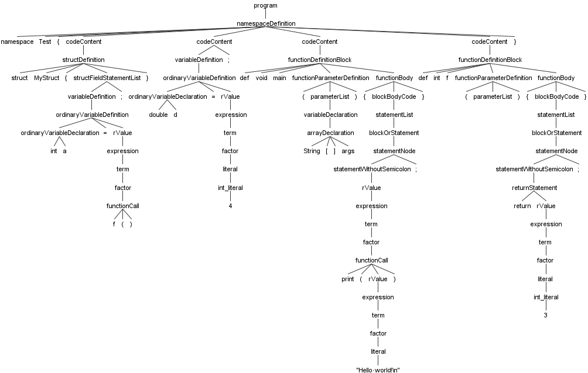
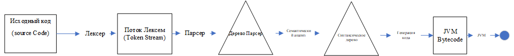

# Курсовая работа, Ильиных Т.А., ИБ-117
Проект включает в себя лексер, парсер. Грамматика - это совмещение двух языков программирования Java и C.  Использовался генератор анализаторов для формальных языков ANTLR.

## Изменено/добавлено:
Создана грамматика записана в файле rules.g4. Также добавлено изображение дерева разбора.

## Сторонние библиотеки

* org.antlr:antlr4:4.8 （для лексического и грамматического анализа）
* org.ow2.asm:asm:8.0.1 （используется для создания байт-кода JVM）

## Поддержка основных языковых функций

* Пространства имен `namespace`
* структура `struct`
* Типы данных：`int` , `double` , `char` , `String`
* `if`, `elif` ,`else` логические блоки
* `for` ，`while`, `break` ，`continue` циклические блоки

## Архитектура компилятора

### Лексический / грамматический анализ

В лексическом анализе используется сторонняя библиотека ANTLR. Все лексическое описание файл грамматики в src/main/antlr/rules.g4

### Семантический анализ

ANTLR использует шаблон Visitor для предоставления доступа к дереву разбора и может рекурсивно обходить дерево, генерируя синтаксическое дерево и добавляя атрибуты.
Через наследование XXXBaseVisitor<...> для получения доступа к дереву разбора.

### Информация о символах и ссылки

Дерево обхода начинается с корневого узла и постепенно спускается, но оно не является строго обходом глубины, поскольку не все атрибуты могут быть получены путем обхода глубины. В процессе обхода дерева другим XXXBaseVisitor<...> подклассом SymbolTableGenerator информация о символах получается из текущего контекста.

